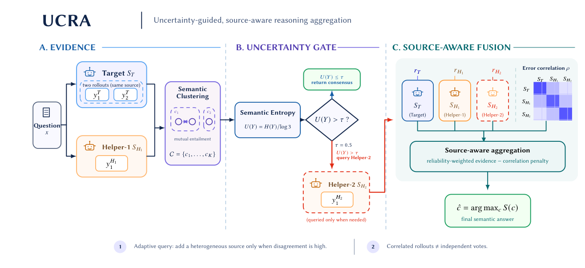

<div align="center">

# UCRA

### Uncertainty-Guided Cross-Source Response Acquisition

**Spend the next reasoning call on a different source only when the current semantic evidence is uncertain.**

[](https://github.com/liu-ming-hua/CRU/actions/workflows/ci.yml)
[](https://www.python.org/)
[](LICENSE)

[Overview](#overview) · [Quick start](#quick-start) · [Online API](#online-api) · [Semantic clustering](#semantic-clustering) · [Citation](#citation)

</div>

<p align="center">
  
</p>

## Overview

Repeated samples from one language model are often correlated: eight answers are not necessarily
eight independent pieces of evidence. **UCRA** uses uncertainty to decide when another model is worth
consulting, then aggregates evidence by source rather than treating every completion as an
independent vote.

The reference policy has three stages:

1. **Warm start** — obtain two responses from the target model and one from helper-1.
2. **Uncertainty-guided acquisition** — cluster semantically equivalent final answers and query
   helper-2 only when normalized empirical semantic entropy exceeds `τ`.
3. **Source-aware fusion** — combine the target distribution and helper answers using frozen source
   reliability and dependence weights.

UCRA is lightweight: it trains no verifier, reads no hidden chain of thought, and requires no token
likelihoods.

## Quick start

```bash
git clone https://github.com/liu-ming-hua/CRU.git
cd CRU
uv sync --extra dev
uv run python examples/toy_ucra.py
uv run pytest -q
```

Expected output:

```text
unanimous-stop: answer=a entropy=-0.000 clusters=(0, 0, 0) helper_2=False calls=3
cross-source-rescue: answer=b entropy=0.579 clusters=(0, 0, 1) helper_2=True calls=4
```

The package has no runtime dependency beyond Python's standard library.

## How the uncertainty gate works

For semantic clusters `c` among `n` valid warm-start responses, UCRA computes

\[
U(Y) = \frac{-\sum_c \hat p(c)\log \hat p(c)}{\log n}.
\]

The reference configuration uses three responses and `τ = 0.5`:

| Answer pattern | Cluster probabilities | `U(Y)` | Action |
|---|---:|---:|---|
| `AAA` | `(1)` | `0.000` | return consensus |
| `AAB` | `(2/3, 1/3)` | `0.579` | query helper-2 |
| `ABC` | `(1/3, 1/3, 1/3)` | `1.000` | query helper-2 |

An invalid or truncated response takes the conservative path and queries helper-2. The policy never
uses the gold answer when clustering, deciding, or fusing.

## Online API

The online interface separates the decision from acquisition, so helper-2 is not called eagerly:

```python
from uncertainty_reasoning.policies import UCRAPolicy

policy = UCRAPolicy(
    target_model="target",
    helper_models=("helper-1", "helper-2"),
    reliabilities={"target": 0.72, "helper-1": 0.76, "helper-2": 0.81},
    evidence_weights={"target": 0.9, "helper-1": 1.0, "helper-2": 1.1},
    entropy_threshold=0.5,
)

decision = policy.decide(target_rollouts, helper_1_response)
helper_2_response = call_helper_2() if decision.query_helper_2 else None
result = policy.finalize(target_rollouts, helper_1_response, helper_2_response)
```

For offline paired evaluation, `policy.run_cached(...)` replays the same decision from a trajectory
pool. Cached replay is an evaluation convenience, not a deployment requirement.

## Semantic clustering

The implementation exposes a small `AnswerClusterer` interface.

### Deterministic benchmark adapter

`CanonicalAnswerClusterer` is the default used by the released reference configuration. It maps
multiple-choice labels to canonical labels and normalizes deterministic numeric/symbolic forms; for
example, `1/2` and `0.5` share a cluster. This is appropriate when the answer space has an exact,
task-defined equivalence rule.

### Free-form extension

`BidirectionalEntailmentClusterer` groups two answers only when a caller-supplied NLI predicate
accepts entailment in both directions. The repository intentionally does not bundle an NLI model:
this adapter documents how free-form semantic equivalence plugs into UCRA, but it was not used to
produce the reference benchmark results.

The complete implementation is in
[`src/uncertainty_reasoning/uncertainty/semantic.py`](src/uncertainty_reasoning/uncertainty/semantic.py).

## Source-aware fusion

UCRA treats all target rollouts as one empirical source distribution and each helper as one source.
For every candidate answer it accumulates a symmetric-error composite log-likelihood based on source
reliability. Non-negative generalized-least-squares-inspired weights reduce the influence of
redundant sources. The maximum-scoring candidate is returned.

The implementation is deliberately modular:

```text
src/uncertainty_reasoning/
├── evaluation/answers.py       final-answer parsing and canonicalization
├── uncertainty/semantic.py     clustering and empirical semantic entropy
├── policies/ucra.py            acquisition decision and source-aware fusion
└── types.py                    response data structures
```

Example parameters are in [`configs/ucra_example_parameters.json`](configs/ucra_example_parameters.json).
For a new collection of models, estimate source reliability and dependence on a held-out development
set, then freeze them before evaluation.

## Repository layout

```text
assets/       method overview in PNG and vector PDF
configs/      example UCRA parameters
examples/     minimal CPU-only execution
src/          reusable method implementation
tests/        gate, clustering, fusion, and answer-normalization tests
```

This public repository intentionally excludes manuscript sources, submission-specific files,
research plans, model weights, datasets, trajectory pools, and internal experiment logs.

## Scope and limitations

- The reference policy has a fixed `2 × target + 1 × helper-1` warm start and at most one helper-2
  acquisition.
- Reliability and dependence parameters must transfer from development data to the deployment
  domain.
- Deterministic clustering is suitable only when answer equivalence can be specified by the task.
- Parameter-scaled token counts are not substitutes for measured latency, energy, or API price.

## Citation

Citation metadata is provided in [`CITATION.cff`](CITATION.cff). A paper-specific BibTeX entry will
be added after the archival record is public.

## License

Released under the [MIT License](LICENSE).
